<div align="center">



<br/>

# 🚢 Titanic Data Analysis

> *A complete end-to-end data science journey — from raw chaos to predictive clarity.*

<br/>


<br/>

</div>

---

## 📌 Table of Contents

- [📖 Overview](#-overview)
- [📁 Project Structure](#-project-structure)
- [🧹 Data Cleaning](#-data-cleaning)
- [🔍 Exploratory Data Analysis](#-exploratory-data-analysis)
- [🤖 Model Training](#-model-training)
- [🛠️ Tech Stack](#%EF%B8%8F-tech-stack)
- [🚀 Getting Started](#-getting-started)
- [📊 Key Findings](#-key-findings)
- [💡 Inspiration & References](#-inspiration--references)

---

## 📖 Overview

On **April 15, 1912**, the RMS Titanic sank after colliding with an iceberg — taking 1,502 lives with her.  
This project dives deep into the Titanic passenger dataset to uncover **who survived, why, and what the data reveals** about survival patterns across gender, class, age, and more.

The pipeline covers:
- 🧹 **Data Cleaning** — handling missing values, outliers, and noisy features  
- 🔍 **Exploratory Data Analysis** — visualizing patterns and relationships  
- 🤖 **Model Training** — building and evaluating a machine learning classifier  

---

## 📁 Project Structure

```
Titanic data analysis/
│
├── 🧹 Data Cleaning/
│   ├── cleaning_titanic_dataset.ipynb    ← Main cleaning notebook
│   ├── Feature_engineering.ipynb         ← Feature creation & transformation
│   ├── titanic_data.csv                  ← Raw original dataset
│   ├── clean_titanic_data.csv            ← Cleaned output
│   ├── cleaned_titanic_data.csv          ← Final processed dataset
│   └── clean.png                         ← Cleaning pipeline visual
│
├── 🔍 Exploratory Data Analysis/
│   ├── Exploratory_Data_Analysis_of_Titanic_dataset.ipynb  ← Full EDA notebook
│   ├── titanic_data.csv                  ← Dataset for analysis
│   ├── titanic.png                       ← EDA visual output
│   └── Untitled.ipynb                    ← Scratch/experiment notebook
│
└── 🤖 Model Training/
    ├── Model_training.ipynb              ← ML model development notebook
    ├── utils.py                          ← Helper functions & utilities
    └── Data/
        └── clean_titanic_data.csv        ← Final dataset used for training
```

---

## 🧹 Data Cleaning

> *Raw data is like the ocean — beautiful but treacherous. We tame it here.*

The **Data Cleaning** module handles all preprocessing to make the Titanic dataset analysis-ready:

- **Missing value imputation** — `Age`, `Cabin`, `Embarked` columns treated with domain-informed strategies
- **Outlier detection** — Fare and Age distributions examined and capped
- **Feature engineering** — New features derived from `Name` (title extraction), `SibSp` + `Parch` (family size), and `Cabin` (deck inference)
- **Data type normalization** — Categorical encoding for `Sex`, `Embarked`, `Pclass`
- **Output** — Clean, model-ready CSV files saved for downstream use

📓 Key Notebooks:
| Notebook | Purpose |
|---|---|
| `cleaning_titanic_dataset.ipynb` | Core cleaning pipeline |
| `Feature_engineering.ipynb` | Advanced feature creation |

---

## 🔍 Exploratory Data Analysis

> *Let the data tell its story before you tell it what to say.*

The **EDA** module uncovers patterns, correlations, and survival insights through rich visualizations:

- 📊 **Survival rate** broken down by gender, passenger class, age group, and embarkation port
- 📈 **Distribution plots** for fare prices, age demographics, and family sizes
- 🔥 **Correlation heatmaps** to spot feature relationships
- 📍 **Class vs. survival analysis** — Was "Women and children first" really enforced?
- 🗺️ **Embarkation port analysis** — Does boarding location correlate with survival?

📓 Key Notebook: `Exploratory_Data_Analysis_of_Titanic_dataset.ipynb`

---

## 🤖 Model Training

> *From insight to intelligence — building a model that predicts survival.*

The **Model Training** module builds, tunes, and evaluates a machine learning classifier:

- ⚙️ **`utils.py`** — Reusable utility functions for preprocessing, evaluation metrics, and pipeline helpers
- 🧪 **Model experiments** — Multiple classifiers tested and compared
- 📉 **Evaluation** — Accuracy, precision, recall, F1-score, and confusion matrix analysis
- 💾 **Clean data pipeline** — Pulls directly from `Data/clean_titanic_data.csv`

📓 Key Notebook: `Model_training.ipynb`

---

## 🛠️ Tech Stack

| Tool | Purpose |
|---|---|
| 🐍 **Python 3.13** | Core programming language |
| 📓 **Jupyter Notebook** | Interactive development environment |
| 🐼 **Pandas** | Data manipulation and analysis |
| 🔢 **NumPy** | Numerical computations |
| 📊 **Matplotlib & Seaborn** | Data visualization |
| 🤖 **Scikit-learn** | Machine learning models & evaluation |

---

## 🚀 Getting Started

### 1. Clone the repository

```bash
git clone https://github.com/your-username/titanic-data-analysis.git
cd titanic-data-analysis
```

### 2. Install dependencies

```bash
pip install pandas numpy matplotlib seaborn scikit-learn jupyter
```

### 3. Run in order

```bash
# Step 1 — Clean the data
jupyter notebook "Data Cleaning/cleaning_titanic_dataset.ipynb"

# Step 2 — Explore the data
jupyter notebook "Exploratory Data Analysis/Exploratory_Data_Analysis_of_Titanic_dataset.ipynb"

# Step 3 — Train the model
jupyter notebook "Model Training/Model_training.ipynb"
```

---

## 📊 Key Findings

> *(To be updated after full analysis)*

- 🔵 **Finding 1** — 
- 🔵 **Finding 2** — 
- 🔵 **Finding 3** — 
- 🔵 **Finding 4** — 

---

## 💡 Inspiration & References

- Took inspiration from [Titanic Survival Prediction](https://github.com/tkarim45/Beginner-Data-Science-Projects/tree/main/Titanic%20Survival%20Prediction) by [tkarim45]

---

<div align="center">

<br/>

*"The ship may have sunk, but the stories it left behind sail forever through data."*

<br/>

⭐ **Star this repo** if you found it helpful!

<br/>


</div>
